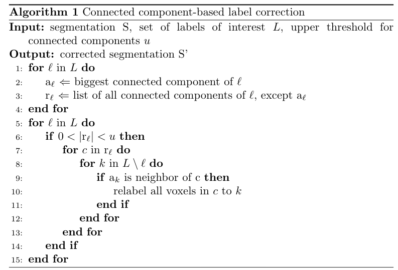

# README

This Repository accompanies the publication CARS-D-22-00067

## HOW TO RUN THIS CODE

### Install all packages
Create a conda environment using 
```
$ conda create --name cars22env --file ./cars22-env.txt
```
or install the packages using pip in a python 3.9 environment:
```
$ pip install -r ./requirements.txt
```
### Synthetic data creation
```
$ python3 generate_synthetic_data.py
```
### Post-processing label correction on demo data
```
$ python3 postprocessing_label_correction_demodata.py
```
### Post-processing label correction as used in the paper:
```
postprocessing_label_correction.py
```
## View the results
All files are loaded and saved in .nii nifty format. To view their content, use e.g. [3D slicer](https://www.slicer.org/).
## HOW TO CITE
TODO: add bibtex
## ALGORITHM
